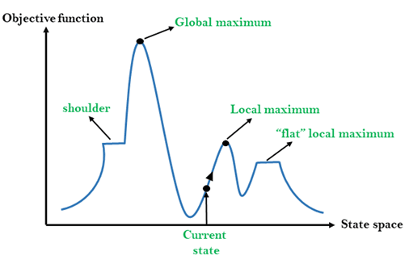

# N-Queens Problem
The N-Queens problem involves placing N chess queens on an N×N chessboard so that no two queens can attack each other

## Permutation (switch columns)
We can think of having N rows, with the queen in a different position in each row.
Then, we start switching rows and check if the new configuration is a solution to the problem.

```
n = 12 : --- 14.39085602760315 seconds ---
n = 10 : --- 0.14400577545166016 seconds ---
n = 8  : --- 0.0060465335845947266 seconds ---
n = 4  : --- 0.0 seconds ---

```
## Hill Climbing Algorithm
A hill-climbing algorithm is an Artificial Intelligence (AI) algorithm that increases in value continuously until it achieves a peak solution.
This algorithm is used to optimize mathematical problems and in other real-life applications like marketing and job scheduling.


* Local maximum: A local maximum is a solution that surpasses other neighboring solutions or states but is not the best possible solution.
* Global maximum: This is the best possible solution achieved by the algorithm.
* Current state: This is the existing or present state.
* Flat local maximum: This is a flat region where the neighboring solutions attain the same value.
* Shoulder: This is a plateau whose edge is stretching upwards.

### Hill Climbing (up and down)
We randomly put queens on the table (create a state) and find the best move (one step up or down with one queen).

We continue this process until:
1. We find the solution
2. We can't improve the state by moving any queens (we generate a new state and start again)

```
n = 15 : --- 20.995646238327026 seconds ---
n = 10 : --- 0.35900020599365234 seconds ---
n = 8  : --- 0.12003731727600098 seconds ---
n = 4  : --- 0.0 seconds ---
```

### Hill Climbing (one Queen, all table)
We randomly put queens on the table (create a state) and find the best move (one queen whole column).

We continue this process until:
1. We find the solution 
2. We can't improve the state by moving any queens (we generate a new state and start again)

```
n = 20 : From --- 1.2290410995483398 seconds --- to --- 19.526131391525269 seconds ---
n = 15 : --- 0.830784797668457 seconds ---
n = 10 : --- 0.129011869430542 seconds ---
n = 8  : --- 0.08101248741149902 seconds ---
n = 4  : --- 0.005039215087890625 seconds ---
```

## Bitwise Solver
The Bitwise Solver is an efficient algorithm for solving the N-Queens problem, using bitwise operations to quickly find solutions.
By leveraging bit manipulation, it efficiently tracks the placement of queens in each row, column, and diagonal.
The solver works by recursively exploring all possible placements of queens row by row and backtracking when an invalid placement is found.

```
n = 30 : --- 59.66193652153015 seconds ---
n = 20 : --- 0.19996333122253418 seconds ---
n = 15 : --- 0.0019996166229248047 seconds ---
n = 10 : --- 0.0 seconds ---
n = 8  : --- 0.0 seconds ---
n = 4  : --- 0.0 seconds ---
```

## Conclusion
In this project, the performance of different algorithms for solving the N-Queens problem was compared, revealing clear differences in efficiency as n increased.
The Bitwise Solver was the fastest and most scalable method, providing quick solutions even for large board sizes.
The Hill Climbing approaches showed moderate efficiency, but struggled with larger n.
The Permutation method was the slowest.
Overall, the Bitwise Solver proved to be the most optimal solution for large-scale N-Queens instances,
making it the preferred choice for solving the problem in a time-efficient manner.
